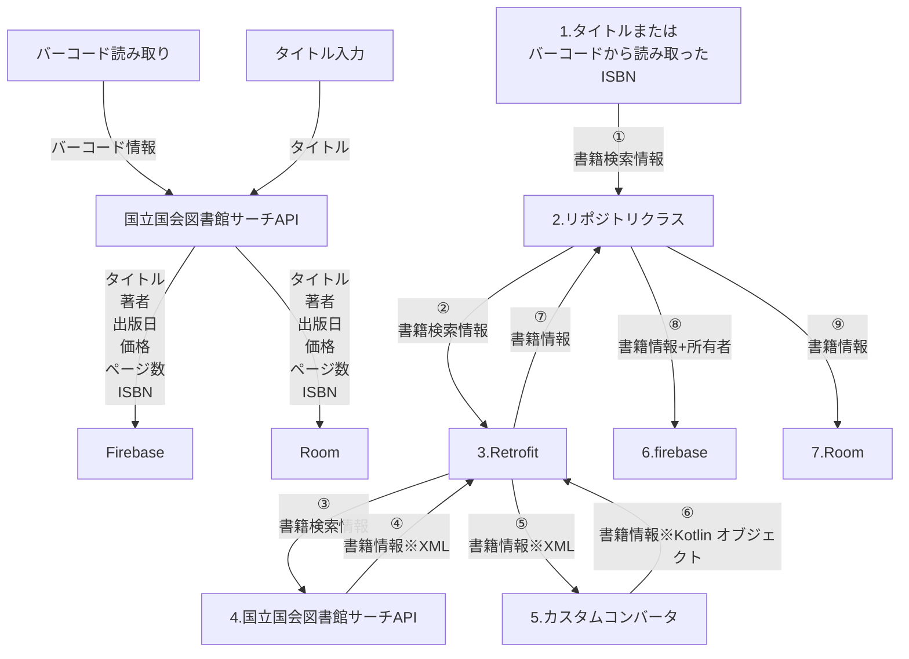
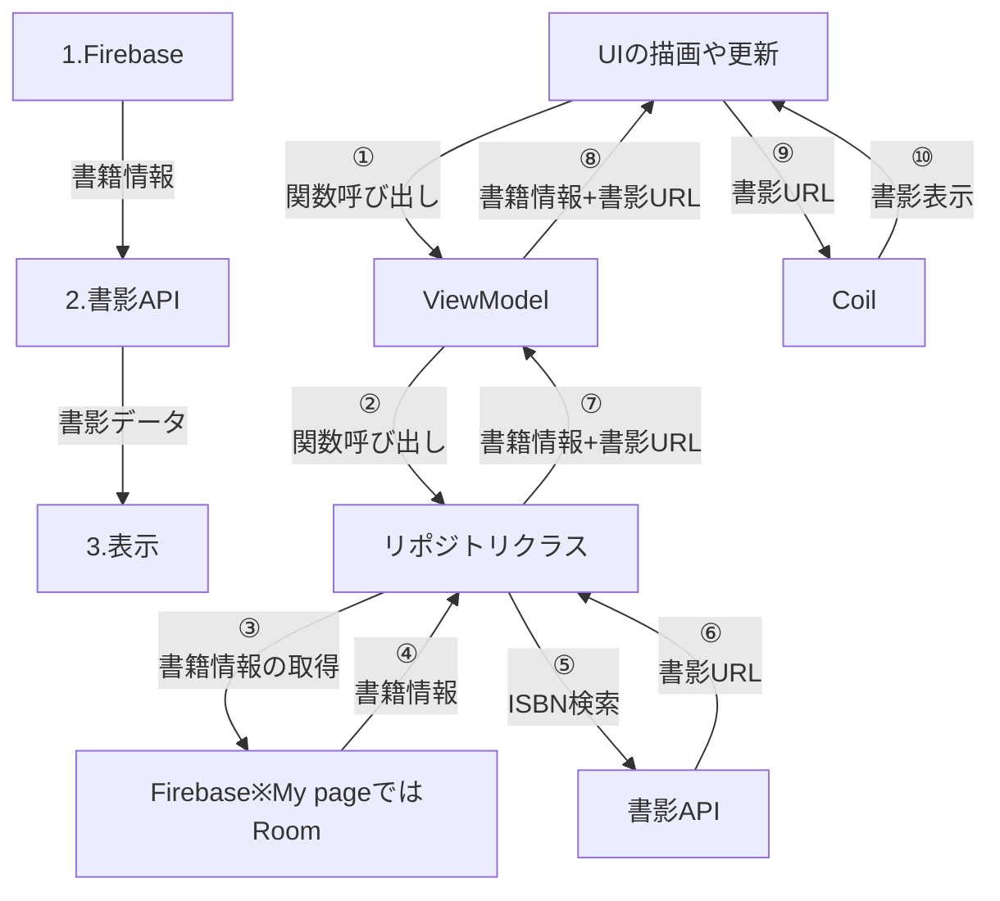

# BookSharing App v2 の仕様書のような何か
##  アプリの機能
###   Home Screen
- 団体の書籍をタグごとに一覧表示
- 書籍のクリックによって書籍の詳細を見る
- 本の詳細から予約
- タグ検索

###   My page
- 自分の所有する書籍を一覧表示
- 書籍の追加
- 書籍の削除
- バーコード読み取りによる書籍の追加

###   Setting
- アプリの設定
- Home 画面のタグの並べ替え

###   その他機能
- ユーザー認証
- 画面遷移用のタブ

---
##  使用する API
###   国立国会図書館
- 国立国会図書館サーチ
- 書影API

国立国会図書館サーチ：書籍の情報の取得に利用

取得する書籍の情報
- タイトル
- 著者
- 出版日
- 価格
- ページ数
- ISBN

書影API：書影データの取得に利用 ※書影APIはISBN検索となる

---
##  使用するライブラリ
- Firebase
- Retrofit
- Coil
- Room
---

## データフロー
### 書籍情報の追加
1. ユーザーがバーコードを読み取るか、タイトルを入力する
2. 国立国会図書館サーチAPIを利用して書籍情報を取得
3. 取得した書籍情報をfirebaseに保存
4. 自分の所有する書籍の情報はRoomにも保存

プログラム内での動き（右図）
1. タイトルまたはバーコードから読み取ったISBNをリポジトリクラスに渡し、Retrofitを利用して国立国会図書館サーチAPIにアクセス
2. 国立国会図書館サーチAPIから書籍情報を取得（XML形式のデータ）
3. Retrofitのカスタムコンバータを利用して、XML形式のデータをKotlinオブジェクトに変換
4. 取得した書籍情報をFirebaseとRoomに保存

### 書籍情報の取得
1. Firebaseから書籍情報を取得
2. ISBNを利用して書影APIから書影データを取得
3. 取得した書籍情報と書影データを表示

プログラム内での動き（右図）
1. UIの描画や更新をトリガーに、ViewModelの関数を呼び出し
2. ViewModelからリポジトリクラスの関数を呼び出し、Firebaseから書籍情報を取得
3. 取得した書籍情報をUIに表示
4. 書籍情報からISBNを利用して書影APIから書影URLを取得
5. 取得した書影URLの画像をCoilで表示
